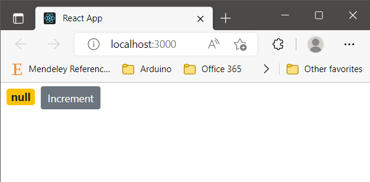
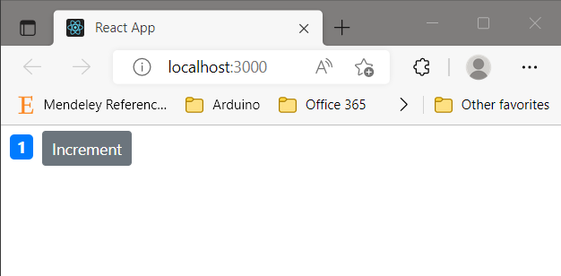
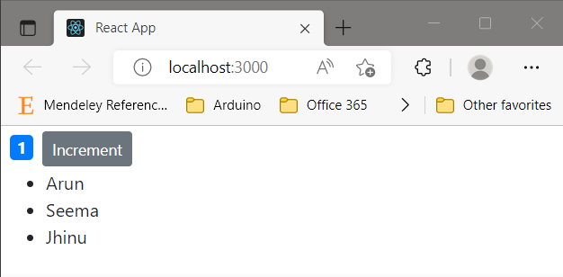
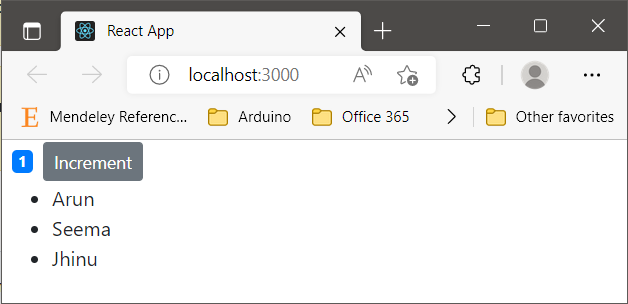
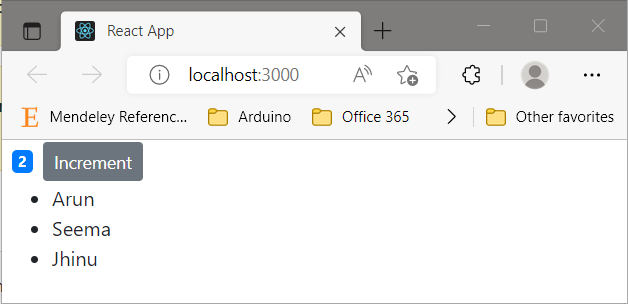

# React App

**_To see how this react-app was initiated go to [README.md](../README.md)_**

## File and Folder Structure

File and folder structures are discussed in detail in `Chapter 10`. Switch to that branch to read more...

## Scratching the surface

Basic work flow of react was discussed in `Chapter 20`. Switch branch to `Chapter 20` to read more.

## Chapter 30 A-Counter-App

### bootstrap

We need `bootstrap` for this project and the same can be installed with.

```bash
npm i bootstrap@4.1.1
# Newer versions are available but to strick with Tutorial this is followed.
```

### Tricks with simple react snippet

-   `imrc` for direct import statement
-   `cc` for creating class directly.

### Creating component

We create a folder `component` inside `src`. This is standard to put all the components inside `src/component`. How to create an empty component?

-   create an empty file counter.jsx
-   type `imrc` and `simple react snippet` addon will do the required import.
-   After that tppe `cc` and autocompletion will create and component class. You have to name the component in multi coursor mode.
-   You can include this component in `src/index.js` as follows

```bash
import Counter from './component/counter';
const root = ReactDOM.createRoot(document.getElementById('root'));
root.render(<Counter/>)
```

### component

We dig somewhat more inside component that we have created. The state of the component is described in `state` variable and `render` method handles and DOM rendering part.

-   If multiple `html` coponents are insdie return statement always enclose them in `<div></div>` or

```jsx
    render() {
        return (
            <div>
                <h1>Hello World</h1>
                <button>Increment</button>
            </div>
        );
    }
```

-   If you do not want to have extra `<div>` appear in your code then you can also use `React.Fragment` to enclose them.

```jsx
    render() {
        return (
            // To Skip having extra div we can use
            <React.Fragment>
                <h1>Hello World</h1>
                <button>Increment</button>
            </React.Fragment>
        );
    }
```

-   If you want to reference something from the state variable you can use curly brackets. Inside curly brackets you can write anything javascrtipt to jsx code.

```jsx
// All are valid
                <span>{this.state.count}</span>
                // or
                <span>{this.formatCount()}</span>
                // or
                <span>{2+2}</span>
```

#### Component Styling

-   You can either use bootstrap classes as you use them in html directly. such as

```jsx
<button className="btn btn-secondary btn-sm">Increment</button>
```

-   If you want to provide your own style there are two ways. Either you can define all your styles in styles variable and later include that in render method. Such as

```jsx
    styles = {
        fontSize: 15,
        fontWeight: "bold",
    };
    render() {
        return (
            <React.Fragment>
                <span style={this.styles}>Hello World</span>
                <button className="btn btn-secondary btn-sm">Increment</button>
            </React.Fragment>
        );
    }
```

-   Or you can also use inline styles. by double curly brackets

```jsx
    render() {
        return (
            <React.Fragment>
                <span style={{fontSize : 30}}>Hello World</span>
                <button className="btn btn-secondary btn-sm">Increment</button>
            </React.Fragment>
        );
    }
```

## Chapter 40 Counter-App-Contd

We want to display the color based on the value of state variable `count`. If it is zero display it yellow otherwise display it blue.



Since `promary` and `warning` class of bootstrap give blue and yellow color by default. So implementing this is as easy.

```jsx
    render() {
        let classes = "badge m-2 badge-";
        classes += this.state.count === 0 ? "warning" : "primary";
        return (
            <React.Fragment>
                <span style={this.styles} className={classes}>
                    {this.formatCount()}
                </span>
                <button className="btn btn-secondary btn-sm">Increment</button>
            </React.Fragment>
        );
    }
```

### How to add multiple list items


This part is self explanatory except that each list item should have a unique id assigned to it.

```jsx
    state = {
        count: 1,
        tags: ["Arun", "Seema", "Jhinu"],
    };
    render() {
            <React.Fragment>
                <span >
                    {this.formatCount()}
                </span>
                <button>Increment</button>
                <ul>
                    {this.state.tags.map((tag) => (<li key={tag}>{tag}</li>))}
                </ul>
            </React.Fragment>
        );
    }

```

## Chapter 50 Counter-App-Events

Let's say we want to update the click counts whenever user clicks Increment button. Whenever user click increment button the count should increase by 1.



After click on `Increment` button


So we can see that we need to implement event handeling

### Handeling Events

Adding event hadeling is easy. We just have to add the method that should be called whenever user click the button and the same can be implemented as such

```jsx
    render() {
        return (
            <React.Fragment>
                <span>{this.formatCount()}</span>
                <button
                    onClick={this.handleIncrement}
                >
                    Increment
                </button>
            </React.Fragment>
        );
    }
    handleIncrement(){
        console.log("Increment Clicked",this);
    };
```
But the issue is that we can not access `this` in `handleIncrement` because by-default it is not bind to this component. The most easy solution to this problem is to use arrow function `=>` such as
```jsx
    handleIncrement = () =>{
        this.state.count +=1
        console.log("Increment Clicked",this);
    };
```
But there is one more problem although we can  directly change state.count property but it will not be reflected in the website view that we are hoping for. Solution?
```jsx
    handleIncrement = () => {
        this.setState({ count: this.state.count + 1 });
    };
```

## How to run

To Runs the app in the development mode.\

```bash
cd react-app
npm start
```

Open [http://localhost:3000](http://localhost:3000) to view it in your browser.

## How to build

```bash
npm run build
```

Builds the app for production to the `build` folder.\
It correctly bundles React in production mode and optimizes the build for the best performance.

Switch to `Chap-60` for next chapter.
